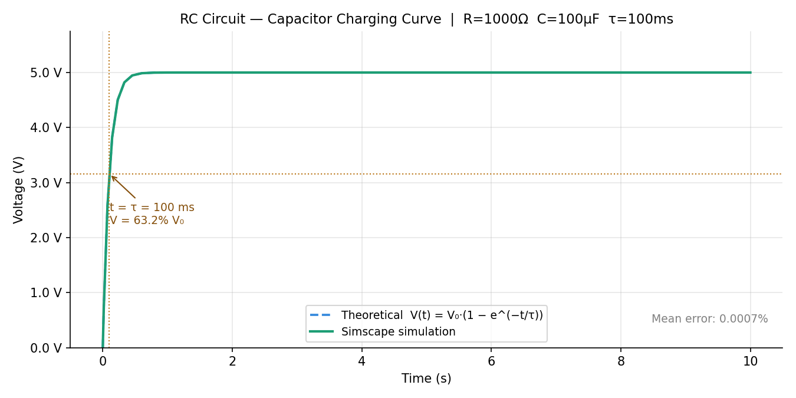

# RC Circuit Simulation — Simscape + Python Analysis


Simulation of a series RC circuit charging/discharging behavior using
**MathWorks Simscape**, with data exported and analyzed in **Python**.
The project compares the simulated curve against the analytical solution
and generates an automated PDF report.

## Circuit parameters

| Parameter | Value |
|-----------|-------|
| Resistance (R) | 1 kΩ |
| Capacitance (C) | 100 µF |
| Source voltage (V₀) | 5 V |
| Time constant (τ) | 100 ms |

## Results



> Mean error between simulation and theoretical curve: **< 0.01%**

## Project structure

```
rc-circuit-simulation/
├── simulink/      # Simscape model (.slx) and parameters script (.m)
├── data/          # CSV exported from Simulink
├── analysis/      # Python scripts (plots + PDF report)
└── report/        # Output figures and final PDF report
```

## How to run

```bash
# 1. In MATLAB: run rc_parameters.m, then simulate rc_circuit.slx
# 2. Run export_to_csv.m to generate data/simulation_output.csv
# 3. In Python:
pip install -r requirements.txt
cd analysis
python plot_results.py
python generate_report.py
```

## Tools used

- MATLAB R2020b + Simscape (MathWorks)
- Python 3.12 — pandas, numpy, matplotlib, fpdf2
- Git / GitHub

## 🧑‍💻 Author

**Carlos Eduardo**\
Electrical Engineering Student 


📧 Email: cguimaraesbarbosa03@gmail.com\
🌐 GitHub: https://github.com/VoIkmer

------------------------------------------------------------------------

## 📚 License

Licensed under the **MIT License**.
